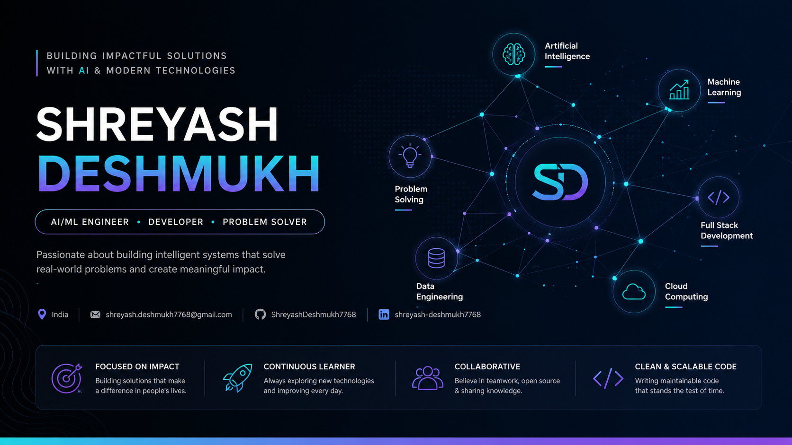

<div align="center">
  
</div>

<p align="right">
  
</p>

<br/>

I build the systems behind the model, not just the model itself — RAG pipelines, retrieval infrastructure, and the APIs that hold them together in production. Final-year Computer Engineering student in Pune, validated at national level: **top 2% of 40,000+ participants** at the India AI Impact Buildathon (Govt. of India × HCL × GUVI, Bharat Mandapam, New Delhi).

```
PROFILE      Shreyash Deshmukh
ROLE         Software Engineer | AI Engineer

EMAIL        dshreyash7768@gmail.com
GITHUB       github.com/ShreyashDeshmukh7768
LINKEDIN     linkedin.com/in/shreyash-deshmukh-a73b00266
LOCATION     Pune, Maharashtra, India

MISSION      Building intelligent, scalable software that solves
             real-world problems through engineering excellence.

────────────────────────────────────────────────────────────────

SOFTWARE     Python · C++ · SQL · FastAPI · Flask · REST APIs

AI           LLMs · RAG · Agentic AI · Prompt Engineering · NLP · TensorFlow

DATA         PostgreSQL · MySQL · MongoDB · Qdrant · ETL · Vector Search

PLATFORM     Docker · Linux · Git · AWS · Google Cloud

TOOLKIT      Hugging Face · Streamlit · Jupyter · Google Colab
```

---

### Signature build — Aarogyan

A full-stack AI medical wellness platform. This is the architecture as it actually ships, not a summary of it.

<div align="center">
  
</div>

The retrieval engine grounds every response in Llama-3.3-70B against a Qdrant index, rather than letting the model answer from memory alone — the part of the system that actually determines whether a medical assistant can be trusted. Deployed on Hugging Face Spaces with authenticated access and automated report generation.

**[→ View repository](#)** <!-- [CUSTOMIZE] link to the real repo -->

---

### Other builds

**Real-time sign language interpreter** — CNN trained on a self-curated 5,200-image dataset, 98% accuracy, offline TTS output. `Python` `OpenCV` `CNN`
**[→ View repository](#)** <!-- [CUSTOMIZE] -->

**Student Information Management System** — Role-based access with JWT and RBAC, schema and indexing tuned for query load. `Flask` `MySQL` `JWT`
**[→ View repository](#)** <!-- [CUSTOMIZE] -->

---

### Record

| Result | Competition | Organizer | Year |
|---|---|---|---|
| National Finalist -> top 2% of 40,000+ | India AI Impact Buildathon | Govt. of India × HCL × GUVI | 2026 |
| Top 7 Finalist | Bharat Gen AI Summit Hackathon | IIT Bombay × DST | 2025 |
| 2nd Rank | Pragyantra National-Level AI Hackathon | Pragyantra | 2026 |
| 2nd Rank | Abhiyantram Project Competition | M-Pulse | 2026 |
| Top 40 of 800+ | iDEA Hackathon | Union Bank of India × KJ Somaiya College | 2025 |
| 2nd National / 1st College Rank | GAME OF CODES | National Coding Competition | 2025 |

Internships: **Google AI/ML** (AICTE) · **AWS Cloud Foundations** (AICTE)

---

## Engineering Telemetry

> _Every commit represents a step toward building reliable, scalable, and impactful software systems._

<p align="center">
  
  
</p>

<p align="center">
  
</p>


<!-- [CUSTOMIZE] replace ShreyashDeshmukh7768 with your GitHub username -->

---

<div align="center">


</div>
